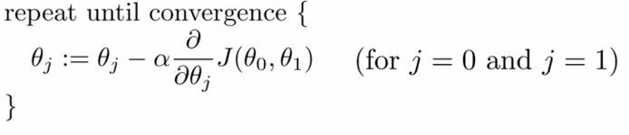
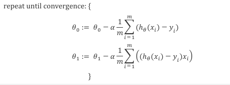
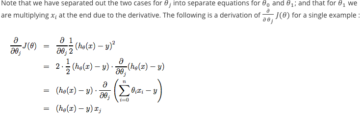
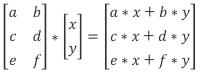
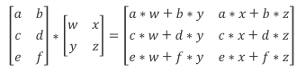
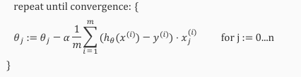

# Definitions

In general, machine learning falls into two categories:

__Supervised__: The algorithm is given a data set with the "right" answers.  Supervised learning problem types:  
  * __Regression__:  Predict continuous value output  
  * __Classification__:  Predict a discrete value given some input(s)

__Unsupervised__: Given data with no labels (i.e. where it is "right" or "wrong") see what insights you can gain about its structure.  
  * __Clustering__:  Group news stories, genetics analysis, organize computer clusters, social network analysis  
  * __Cocktail Party Algorithm__:  Weed out single source of input from a group of inputs that have been blended together.

__Tools__:  Octave and Matlab

# Linear Regression

__Training Set__  
  * m = number of training examples
  * x's = input variables/features
  * y's = output/target variable
  * (x,y) = one examples
  * (x(i), y(i)) = ith training example
  * h = function that is returned by learning alogorith.  h stands for hypothesis.    h&#952;(x) = &#952;0 + &#952;1x

  Linear regression with one variable (univariate).

# Cost Function
How to fit the best possible straight line to our data.  
&#952;0 and &#952;1 are parameters.  How to choose these?
<table><tbody><tr><td>1/2m * </td><td>
m  
&#8721; (h&#952;(x(i)) - y(i))2  
i=1
</td></tr></tbody></table>

Find a hypothesis &#952;0 + &#952;1x  
such that the sum of the squared difference of the result of the function and the actual value is minimized.  Divide by m to get the average difference.  Not sure why we multiply by half.  Something to do with "computation of the gradient descent" and the "derivative term of the square will cancel out the 1/2".  Reading about 'gradient descent' [here](https://www.kdnuggets.com/2017/04/simple-understand-gradient-descent-algorithm.html).

Also called squared error function.

# Gradient descent

Algorithm for solving minimization problems.

&#945; -> alpha -> learning rate; how big a step we take down hill

Batch Gradient Descent - Use all the values in the training set.

Gradient Descent for linear Regression

Explanation:

# Matrix Math

Vector == 1 column Matrix

Matrix Addition
- Must be same dimensions
- Add each element at same position  
- Result is matrix of same dimensions

Matrix Multiplication w/ Scalars
- Scalar == Real single number
- Just multiply each element in the matrix by the Scalar
- Result is matrix of same dimensions
- Division works same (multiply by inverse)

Matrix Multiplication w/ Vector

- Matrix can only be multiplied by a vector with a number of rows equal to the number of columns in the matrix.
- Matrix `A` times vector `x` = a vector `y` such that a matrix of size (m,n) multiplied by a vector of n dimensions, equals a vector of m dimensions, where each vector value (mi) is the sum of the products (mi, nj) * nj.

  

- Matrix / Vector multiplication is helpful in evaluating a cost function because the implementation (in code) is much simpler (one line vs. a for loop) and proves to be much more computationally efficient.  

Matrix / Matrix multiplication

- Only possible if the dimensions of the matrices are compatible such that the number of columns in the first matrix, each the number of rows in the 2nd matrix, with the result being a matrix with dimensions equal to the the number of rows in the first vector, and the number of columns in the 2nd matrix.
- To compute, take each column of the 2nd matrix and perform vector multiplication against the first matrix.  The resulting vector is a column in the new matrix.
  
- Commutative property of multiplication __does not__ apply to matrices.
- Associative property of multiplication __does__ apply to matrices. A x B x C = (A x B) x C = A x (B x C).
- Identify property of 1 -> 1 x z = z.
- Identity matrix (_I_) is n x n in size and has 1's along a diagonal from upper left to lower right, and 0's everywhere else. A x _I_ = _I_ x A = A, where each of the identity matrixes may not have the same dimensions.

Matrix inverse

- A matrix's inverse is one such that A x A-1 = A-1 x A = _I_ or the identity matrix.  Only true for m x m matrices, otherwise known as square matrices.  
- Not all matrices have inverses (e.g. an all 0 square matrix).  These matrices are called "singular" or "degenerate" matrix.

Matrix Transpose
- Basically, rows become columns, or flipping along a 45 degree axis. e.g. A (m x n matrix), has a transposed matrix B = AT, then B is an n x m matrix, and Bij = Aij

# Multivariate Linear Regression

n = number of features (input variables)  
m = number of training examples  
xi = the ith training example from the set.  Represented as a Vector
xj(i) = the jth feature of the ith training example.

hypothesis = h&#952;(x) = &#952;0 + &#952;1x1 + &#952;2x2 + . . . + &#952;nxn

by convention, we also define x0 = 1, so that the formula can be rewritten as
h&#952;(x) = &#952;0x0 + &#952;1x1 + &#952;2x2 + . . . + &#952;nxn

With matrix math this can be further refined to:

h&#952;(x) = &#952;Tx, where &#952; is a vector of all the theta values in order, and x is a vector of all the features.

Gradient Descent for multivariate linear Regression

- In order to get gradient to converge quickly, it is helpful to scale the features so that their values are in a similar range, usually -1 <= x <= 1, but not much more than -3 to 3 and not less than -1/3 to 1/3.
- It is also useful to perform "mean normalization", which converts the value of the feature to something smaller.
- Scale as follows:  
  x1 - &#956;1  / s1   
  where mu is the mean value of x in the training set and s is the standard deviation or the range between the max and min for x.

## Normal Equation - Method for solving for &#952; analytically  

A lot of calculus, but the optimal value for &#952; is:

&#952; = (XTX)-1XTy

Which in English is, inverse of the product of the transposed matrix and the matrix, times the transposed matrix times y.

Using this approach, feature scaling is not required.

When to use Gradient Descent vs. Normal Equation?

m = examples, n = features

| Gradient Descent | Normal Equation |
|------------------           |-----------------|
| Need to choose learning rate | Learning rate not needed |
| Needs many iterations | No need to iterate|
| Works well even when n is large | Need to compute (XTX)-1 . . .
||Which can be slow if n is large - Big O to the 3rd on most languages|
||n = 100 -> ok, 1000 -> ok, 10_000 -> start thinking Gradient Descent|

What if (XTX) is not invertable?  
This can happen when you have a feature set where two features are linearly dependent (e.g. dimensions in feet and dimensions in meters), and when you have more features than training examples.

Languages like Octave and Mathlab can handle this, the have functions that can perform the sudo inverse instead of the pure inverse.
