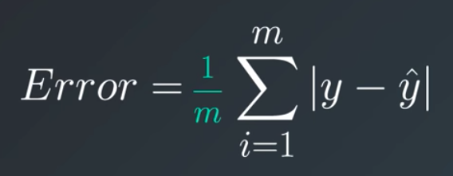
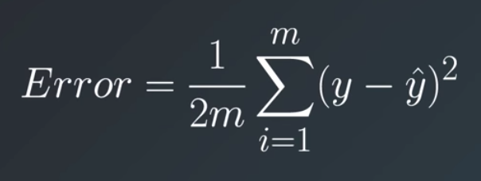
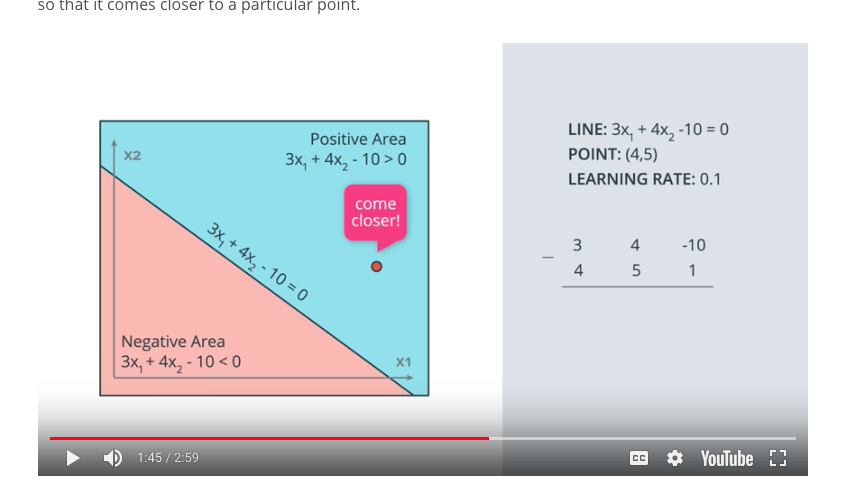
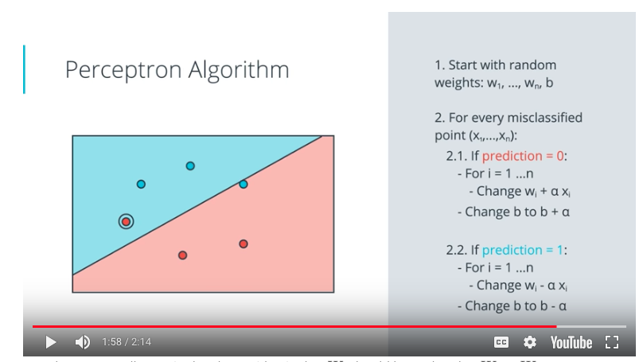
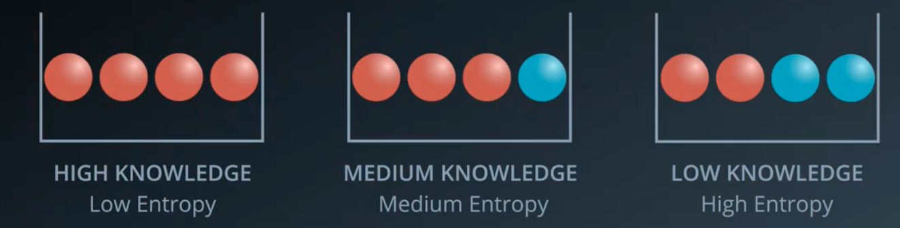
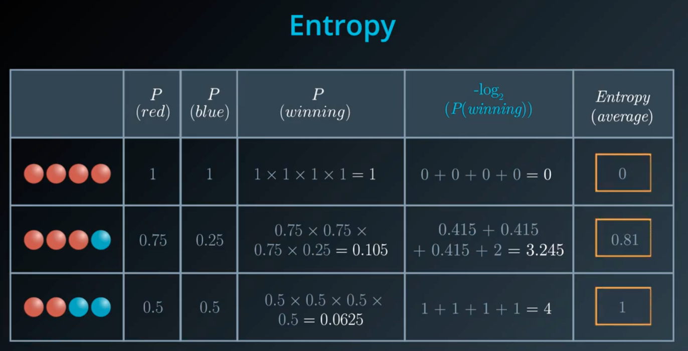
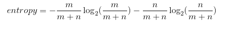
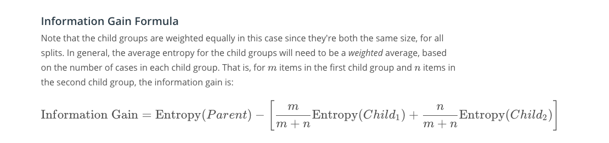
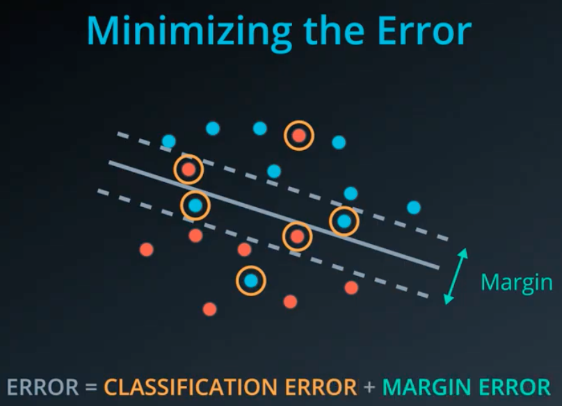
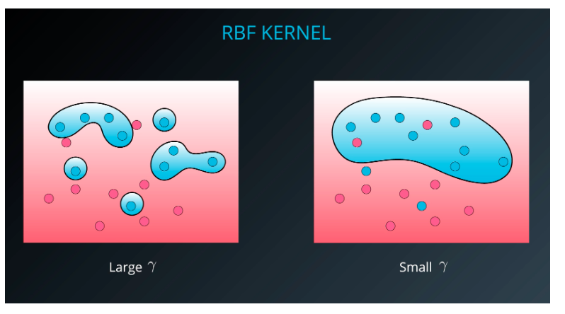

- Latex - Markdown for math.  https://www.latex-project.org/

## Jupyter Notebooks
Magic Commands - http://ipython.readthedocs.io/en/stable/interactive/magics.html

Python Debugger - https://docs.python.org/3/library/pdb.html

Notebooks are just JSON files with the extension `.ipynb`.

To convert a notebook to a different format:

`$ jupyter nbconvert --to <format> <notebookName.ipynb>

From the UI in a notebook, you can go to _View -> Cell Toolbar -> Slides_ to designate what type of slide each cell should be.  Then, when you do an `nbconvert --to slides`, you have a slide show that is viewable in a browser. 

## Branches of Machine Learning

### Supervised 
Uses labeled data
1. Classification - Puts things into a category.
2. Regression - Predicts a numeric value on a continuum

### Unsupervised
No Labels to train on
1. Grouping similar items
2. Music recommendation

### Reinforcement
Takes actions and responds to positive or negative outcomes
1. Self driving cars
2. Game play -> https://deepmind.com/blog/alphago-zero-learning-scratch/

### Deep Learning
Technique that can be used for Supervised, Unsupervised, and Reinforcement learning.  
3 major barriers
1. Must have enough data.
2. Must have enough computing power.
3. Can't understand why decisions are made.

## scikit learn
Python library used for supervised and unsupervised learning problems.

----

## Linear Regression

- Absolute Trick (For finding best fit line): To bring a line closer to a point _(p,q)_, you could adjust the line by adding 1 to the y intercept value, and add _p_ to the slope, but this may produce too dramatic of a change in the line and "go past" the point.  Instead, multiply 1 and _p_ by the learning Rate, expressed as alpha (&#945;) to make it move a small amount.  If the point falls below the line, then subtract instead of add.  The reason we use _p_ as the additive value for the slope is two fold.  First, if _p_ is negative it adjusts the slope appropriately.  Second, if _p_ has a large absolute value (far from the y axis), then the slope will be adjusted more dramatically than if it is close, which is the behavior we want.  Final equation:
y= (w1 + p&#945;)x + (w2 + &#945;)  

- Square Trick (For finding best fit line): Similar to absolute trick except it also takes into consideration the difference in vertical distance between the point and the line.

y= (w1 + p(q-q prime)&#945;)x + (w2 + (q-q prime)&#945;) 

###Gradient Descent: 

Minimizing error.

Mean Absolute Error: The mean (average) of all the errors for all the points in the data set.  The error is the absolute difference in y values between the y value of the point and the y value of the line where x in the x, y coordinate on the line equals x of the point.



Mean Squared Error: 
The average of the error squared, but multiplied by a half.  Half is for convenience when we use derivatives later.




These error tests can be applied by all the errors at once (batch), each error individually (Stochastic), or a combo (mini-batches).

###Regularization

The process of looking at the complexity of an equation, and "adding"" that into the error factor of the model, so that we favor simpler models when appropriate.  The complexity is reflected in the coefficients of the variables.

Simpler models tend to generalize better and not "over-fit".  In statistics, overfitting is "the production of an analysis that corresponds too closely or exactly to a particular set of data, and may therefore fail to fit additional data or predict future observations reliably".

###Feature Scaling

Feature scaling is a way of transforming your data into a common range of values. There are two common scalings:

- Standardizing
- Normalizing

**Standardizing** is completed by taking each value of your column, subtracting the mean of the column, and then dividing by the standard deviation of the column.

With a DataFrame (df) having a column (height)...
```
df["height_standard"] = (df["height"] - df["height"].mean()) / df["height"].std()
```

**Normalizing** A second type of feature scaling that is very popular is known as normalizing. With normalizing, data are scaled between 0 and 1.

```
df["height_normal"] = (df["height"] - df["height"].min()) /     \
                      (df["height"].max() - df['height'].min())
```

**When Should I Use Feature Scaling?**
In many machine learning algorithms, the result will change depending on the units of your data. This is especially true in two specific cases:

1. When your algorithm uses a distance-based metric to predict.
1. When you incorporate regularization.

**Distance Based Metrics**
In future lessons, you will see one common supervised learning technique that is based on the distance points are from one another called Support Vector Machines (or SVMs). Another technique that involves distance based methods to determine a prediction is k-nearest neighbors (or k-nn). With either of these techniques, choosing not to scale your data may lead to drastically different (and likely misleading) ending predictions.

**Regularization**
When you start introducing regularization, you will again want to scale the features of your model. The penalty on particular coefficients in regularized linear regression techniques depends largely on the scale associated with the features. When one feature is on a small range, say from 0 to 10, and another is on a large range, say from 0 to 1 000 000, applying regularization is going to unfairly punish the feature with the small range. Features with small ranges need to have larger coefficients compared to features with large ranges in order to have the same effect on the outcome of the data. (Think about how ab=ba for two numbers a and b.) Therefore, if regularization could remove one of those two features with the same net increase in error, it would rather remove the small-ranged feature with the large coefficient, since that would reduce the regularization term the most.

Again, this means you will want to scale features any time you are applying regularization.

A useful [Quora post](https://www.quora.com/Why-do-we-normalize-the-data) on the importance of feature scaling when using regularization.
A point raised in the article above is that feature scaling can speed up convergence of your machine learning algorithms, which is an important consideration when you scale machine learning applications.

**Recap**
In this lesson, you were introduced to linear models. Specifically, you saw:

- Gradient descent as a method to optimize your linear models.
- Multiple Linear Regression as a technique for when you are comparing more than two variables.
- Polynomial Regression for relationships between variables that aren't linear.
- Regularization as a technique to assure that your models will not only fit to the data available, but also extend to new situations.

---

##Perceptron Algorithm (a classification solution)

Classifying based upon input variables:

w<sub>1</sub>x<sub>1</sub> + w<sub>2</sub>x<sub>2</sub> + ... +
w<sub>n</sub>x<sub>n</sub>

or simply 

Wx + b = 0

Where _w_ is the weight assigned to each input variable, and X<sub>n</sub> is the input variable.  We are trying to find a line (plane) so that classifies each instance either in the group or not.  The prediction (y hat) is 1 if Wx + b >= 0 and 0 if Wx + b < 0. b stands for bias.

The score is computed as a linear function, and the prediction is a step function.

**Perceptron** is related to neural networks, and is a graph data structure.

Some logical operators can be implemented as perceptrons.

Trick to bring a line closer to a point


Take each of the coeficients for the variables, and add the values of the point in error, multiplied by a learning rate.  For the bias
just use 1.

**Perceptron Algorithm**


## Decision Trees

**Entropy** - How much freedom as particle have to move around (in science), or how much knowledge do we have about a group. By knowledge, we mean, if we were to select a ball at random from each of the sets below, how much confidence would we have in knowing which ball was selected.









## Naive Bayes

## Support Vector Machines

- Classification algorithm
- Maximize the distance between the points and the best fit line
- The error of the best fit line is two parts: the error computed for points classified incorrectly, and those points classified incorrectly within the margin.



- C Parameter - A constant that affects the weight that classification errors carry relative to margin errors.

- Kernal trick - using polynomials to find lines

- Radial Basis Function (RBF)

**Recap**  
In this lesson, you learned about Support Vector Machines (or SVMs). SVMs are a popular algorithm used for classification problems. You saw three different ways that SVMs can be implemented:

1. Maximum Margin Classifier
1. Classification with Inseparable Classes
1. Kernel Methods

**Maximum Margin Classifier**  
When your data can be completely separated, the linear version of SVMs attempts to maximize the distance from the linear boundary to the closest points (called the support vectors). For this reason, we saw that in the picture below, the boundary on the left is better than the one on the right.

**Classification with Inseparable Classes**  
Unfortunately, data in the real world is rarely completely separable as shown in the above images. For this reason, we introduced a new hyper-parameter called C. The C hyper-parameter determines how flexible we are willing to be with the points that fall on the wrong side of our dividing boundary. The value of C ranges between 0 and infinity. When C is large, you are forcing your boundary to have fewer errors than when it is a small value.

**Note: when C is too large for a particular set of data, you might not get convergence at all because your data cannot be separated with the small number of errors allotted with such a large value of C.**

**Kernels**  
Finally, we looked at what makes SVMs truly powerful, kernels. Kernels in SVMs allow us the ability to separate data when the boundary between them is nonlinear. Specifically, you saw two types of kernels:

- polynomial
- rbf

By far the most popular kernel is the rbf kernel (which stands for radial basis function). The rbf kernel allows you the opportunity to classify points that seem hard to separate in any space. This is a density based approach that looks at the closeness of points to one another. This introduces another hyper-parameter gamma. When gamma is large, the outcome is similar to having a large value of C, that is your algorithm will attempt to classify every point correctly. Alternatively, small values of gamma will try to cluster in a more general way that will make more mistakes, but may perform better when it sees new data.

