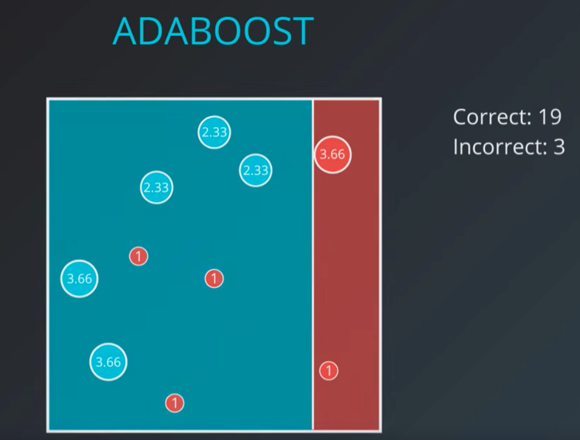
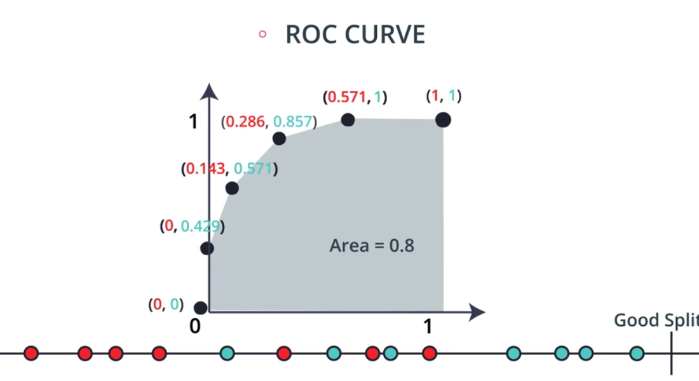
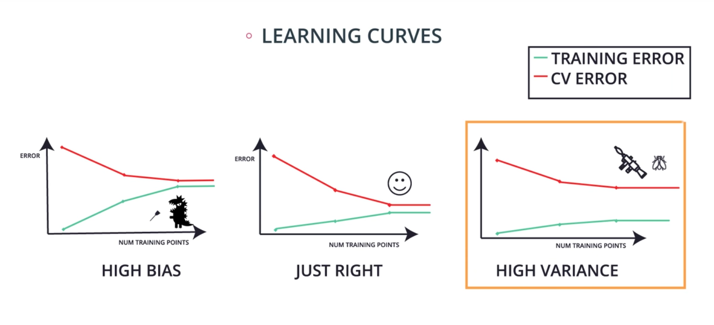
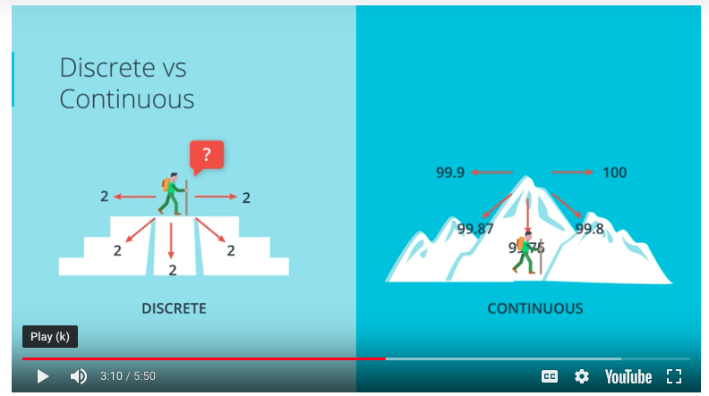
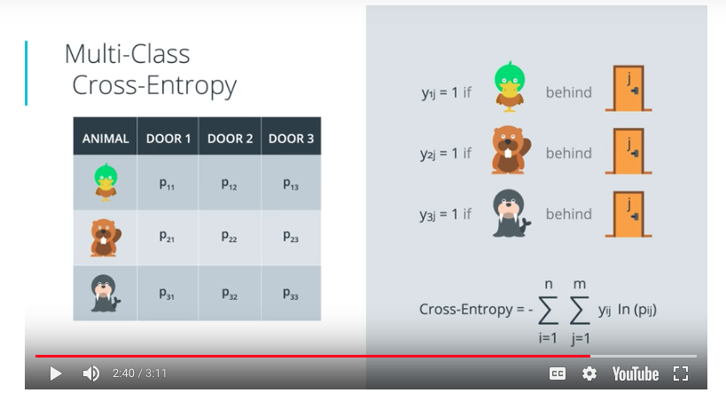
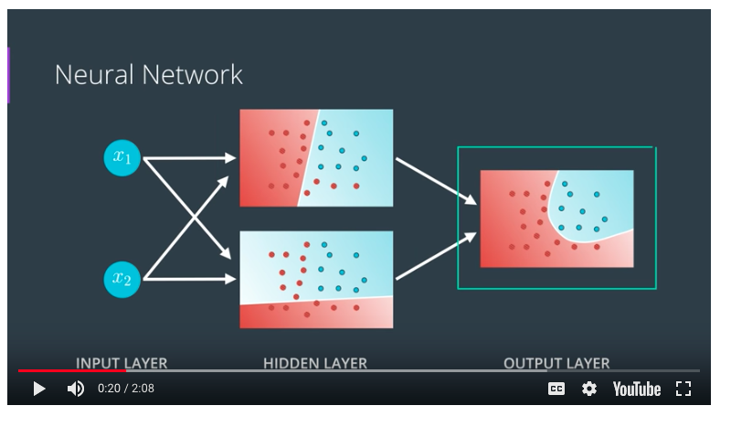
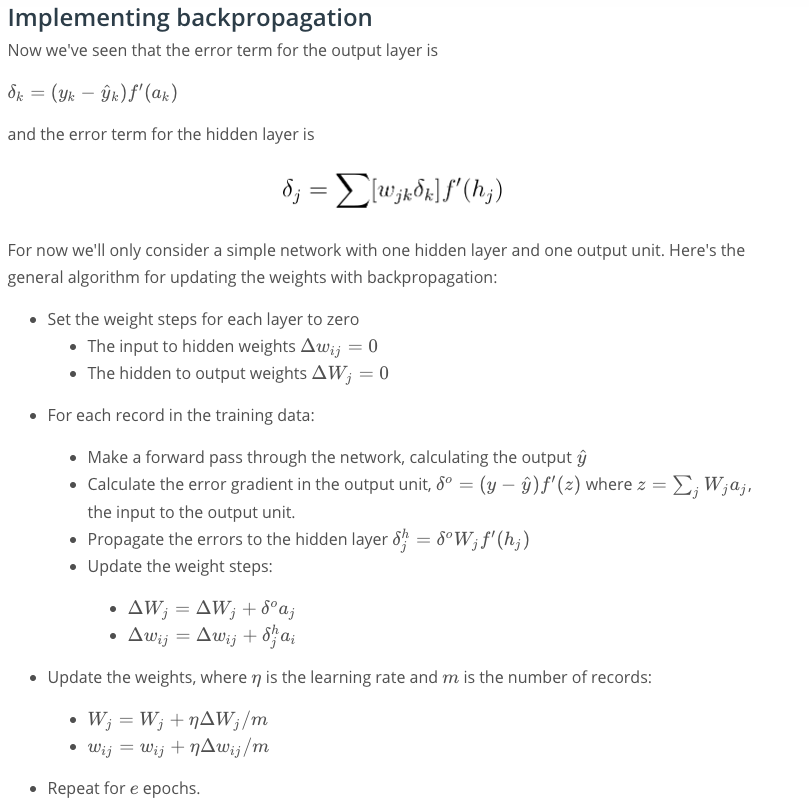
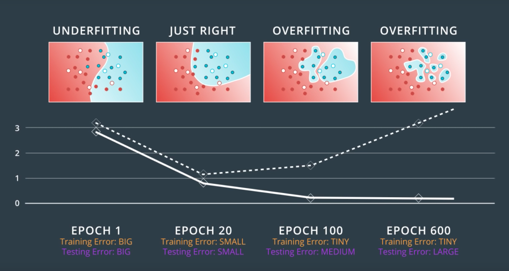
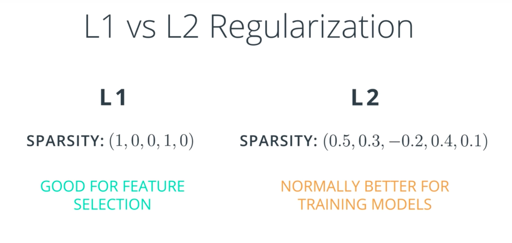

- Latex - Markdown for math.  https://www.latex-project.org/

## Jupyter Notebooks
Magic Commands - http://ipython.readthedocs.io/en/stable/interactive/magics.html

Python Debugger - https://docs.python.org/3/library/pdb.html

Notebooks are just JSON files with the extension `.ipynb`.

To convert a notebook to a different format:

`$ jupyter nbconvert --to <format> <notebookName.ipynb>

From the UI in a notebook, you can go to _View -> Cell Toolbar -> Slides_ to designate what type of slide each cell should be.  Then, when you do an `nbconvert --to slides`, you have a slide show that is viewable in a browser. 

## Branches of Machine Learning

### Supervised 
Uses labeled data
1. Classification - Puts things into a category.
2. Regression - Predicts a numeric value on a continuum

### Unsupervised
No Labels to train on
1. Grouping similar items
2. Music recommendation

### Reinforcement
Takes actions and responds to positive or negative outcomes
1. Self driving cars
2. Game play -> https://deepmind.com/blog/alphago-zero-learning-scratch/

### Deep Learning
Technique that can be used for Supervised, Unsupervised, and Reinforcement learning.  
3 major barriers
1. Must have enough data.
2. Must have enough computing power.
3. Can't understand why decisions are made.

## scikit learn
Python library used for supervised and unsupervised learning problems.

----

## Linear Regression

- Absolute Trick (For finding best fit line): To bring a line closer to a point _(p,q)_, you could adjust the line by adding 1 to the y intercept value, and add _p_ to the slope, but this may produce too dramatic of a change in the line and "go past" the point.  Instead, multiply 1 and _p_ by the learning Rate, expressed as alpha (&#945;) to make it move a small amount.  If the point falls below the line, then subtract instead of add.  The reason we use _p_ as the additive value for the slope is two fold.  First, if _p_ is negative it adjusts the slope appropriately.  Second, if _p_ has a large absolute value (far from the y axis), then the slope will be adjusted more dramatically than if it is close, which is the behavior we want.  Final equation:
y= (w1 + p&#945;)x + (w2 + &#945;)  

- Square Trick (For finding best fit line): Similar to absolute trick except it also takes into consideration the difference in vertical distance between the point and the line.

y= (w1 + p(q-q prime)&#945;)x + (w2 + (q-q prime)&#945;) 

###Gradient Descent: 

Minimizing error.

Mean Absolute Error: The mean (average) of all the errors for all the points in the data set.  The error is the absolute difference in y values between the y value of the point and the y value of the line where x in the x, y coordinate on the line equals x of the point.


Mean Squared Error: 
The average of the error squared, but multiplied by a half.  Half is for convenience when we use derivatives later.


These error tests can be applied by all the errors at once (batch), each error individually (Stochastic), or a combo (mini-batches).

###Regularization

The process of looking at the complexity of an equation, and "adding"" that into the error factor of the model, so that we favor simpler models when appropriate.  The complexity is reflected in the coefficients of the variables.

Simpler models tend to generalize better and not "over-fit".  In statistics, overfitting is "the production of an analysis that corresponds too closely or exactly to a particular set of data, and may therefore fail to fit additional data or predict future observations reliably".

###Feature Scaling

Feature scaling is a way of transforming your data into a common range of values. There are two common scalings:

- Standardizing
- Normalizing

**Standardizing** is completed by taking each value of your column, subtracting the mean of the column, and then dividing by the standard deviation of the column.

With a DataFrame (df) having a column (height)...
```
df["height_standard"] = (df["height"] - df["height"].mean()) / df["height"].std()
```

**Normalizing** A second type of feature scaling that is very popular is known as normalizing. With normalizing, data are scaled between 0 and 1.

```
df["height_normal"] = (df["height"] - df["height"].min()) /     \
                      (df["height"].max() - df['height'].min())
```

**When Should I Use Feature Scaling?**
In many machine learning algorithms, the result will change depending on the units of your data. This is especially true in two specific cases:

1. When your algorithm uses a distance-based metric to predict.
1. When you incorporate regularization.

**Distance Based Metrics**
In future lessons, you will see one common supervised learning technique that is based on the distance points are from one another called Support Vector Machines (or SVMs). Another technique that involves distance based methods to determine a prediction is k-nearest neighbors (or k-nn). With either of these techniques, choosing not to scale your data may lead to drastically different (and likely misleading) ending predictions.

**Regularization**
When you start introducing regularization, you will again want to scale the features of your model. The penalty on particular coefficients in regularized linear regression techniques depends largely on the scale associated with the features. When one feature is on a small range, say from 0 to 10, and another is on a large range, say from 0 to 1 000 000, applying regularization is going to unfairly punish the feature with the small range. Features with small ranges need to have larger coefficients compared to features with large ranges in order to have the same effect on the outcome of the data. (Think about how ab=ba for two numbers a and b.) Therefore, if regularization could remove one of those two features with the same net increase in error, it would rather remove the small-ranged feature with the large coefficient, since that would reduce the regularization term the most.

Again, this means you will want to scale features any time you are applying regularization.

A useful [Quora post](https://www.quora.com/Why-do-we-normalize-the-data) on the importance of feature scaling when using regularization.
A point raised in the article above is that feature scaling can speed up convergence of your machine learning algorithms, which is an important consideration when you scale machine learning applications.

**Recap**
In this lesson, you were introduced to linear models. Specifically, you saw:

- Gradient descent as a method to optimize your linear models.
- Multiple Linear Regression as a technique for when you are comparing more than two variables.
- Polynomial Regression for relationships between variables that aren't linear.
- Regularization as a technique to assure that your models will not only fit to the data available, but also extend to new situations.

---

##Perceptron Algorithm (a classification solution)

Classifying based upon input variables:

w<sub>1</sub>x<sub>1</sub> + w<sub>2</sub>x<sub>2</sub> + ... +
w<sub>n</sub>x<sub>n</sub>

or simply 

Wx + b = 0

Where _w_ is the weight assigned to each input variable, and X<sub>n</sub> is the input variable.  We are trying to find a line (plane) so that classifies each instance either in the group or not.  The prediction (y hat) is 1 if Wx + b >= 0 and 0 if Wx + b < 0. b stands for bias.

The score is computed as a linear function, and the prediction is a step function.

**Perceptron** is related to neural networks, and is a graph data structure.

Some logical operators can be implemented as perceptrons.

Trick to bring a line closer to a point


Take each of the coeficients for the variables, and add the values of the point in error, multiplied by a learning rate.  For the bias
just use 1.

**Perceptron Algorithm**


## Decision Trees

**Entropy** - How much freedom as particle have to move around (in science), or how much knowledge do we have about a group. By knowledge, we mean, if we were to select a ball at random from each of the sets below, how much confidence would we have in knowing which ball was selected.


## Naive Bayes

## Support Vector Machines

- Classification algorithm
- Maximize the distance between the points and the best fit line
- The error of the best fit line is two parts: the error computed for points classified incorrectly, and those points classified incorrectly within the margin.


- C Parameter - A constant that affects the weight that classification errors carry relative to margin errors.

- Kernal trick - using polynomials to find lines

- Radial Basis Function (RBF)

**Recap**  
In this lesson, you learned about Support Vector Machines (or SVMs). SVMs are a popular algorithm used for classification problems. You saw three different ways that SVMs can be implemented:

1. Maximum Margin Classifier
1. Classification with Inseparable Classes
1. Kernel Methods

**Maximum Margin Classifier**  
When your data can be completely separated, the linear version of SVMs attempts to maximize the distance from the linear boundary to the closest points (called the support vectors). For this reason, we saw that in the picture below, the boundary on the left is better than the one on the right.

**Classification with Inseparable Classes**  
Unfortunately, data in the real world is rarely completely separable as shown in the above images. For this reason, we introduced a new hyper-parameter called C. The C hyper-parameter determines how flexible we are willing to be with the points that fall on the wrong side of our dividing boundary. The value of C ranges between 0 and infinity. When C is large, you are forcing your boundary to have fewer errors than when it is a small value.

**Note: when C is too large for a particular set of data, you might not get convergence at all because your data cannot be separated with the small number of errors allotted with such a large value of C.**

**Kernels**  
Finally, we looked at what makes SVMs truly powerful, kernels. Kernels in SVMs allow us the ability to separate data when the boundary between them is nonlinear. Specifically, you saw two types of kernels:

- polynomial
- rbf

By far the most popular kernel is the rbf kernel (which stands for radial basis function). The rbf kernel allows you the opportunity to classify points that seem hard to separate in any space. This is a density based approach that looks at the closeness of points to one another. This introduces another hyper-parameter gamma. When gamma is large, the outcome is similar to having a large value of C, that is your algorithm will attempt to classify every point correctly. Alternatively, small values of gamma will try to cluster in a more general way that will make more mistakes, but may perform better when it sees new data.


## Ensemble Methods

This whole lesson (on ensembles) is about how we can combine (or ensemble) the models you have already seen in a way that makes the combination of these models better at predicting than the individual models.

Commonly the "weak" learners you use are decision trees. In fact the default for most ensemble methods is a decision tree in sklearn. However, you can change this value to any of the models you have seen so far.

**Why Would We Want to Ensemble Learners Together?**  
There are two competing variables in finding a well fitting machine learning model: **Bias** and **Variance**. It is common in interviews for you to be asked about this topic and how it pertains to different modeling techniques. As a first pass, the wikipedia is quite useful. However, I will give you my perspective and examples:

**Bias:** When a model has high bias, this means that means it doesn't do a good job of bending to the data. An example of an algorithm that usually has high bias is linear regression. Even with completely different datasets, we end up with the same line fit to the data. When models have high bias, this is bad.

**Variance:** When a model has high variance, this means that it changes drastically to meet the needs of every point in our dataset. Linear models like the one above is low variance, but high bias. An example of an algorithm that tends to have a high variance and low bias is a decision tree (especially decision trees with no early stopping parameters). A decision tree, as a high variance algorithm, will attempt to split every point into it's own branch if possible. This is a trait of high variance, low bias algorithms - they are extremely flexible to fit exactly whatever data they see.

By combining algorithms, we can often build models that perform better by meeting in the middle in terms of bias and variance. There are some other tactics that are used to combine algorithms in ways that help them perform better as well. These ideas are based on minimizing bias and variance based on mathematical theories, like the central limit theorem.

**Introducing Randomness Into Ensembles**  
Another method that is used to improve ensemble methods is to introduce randomness into high variance algorithms before they are ensembled together. The introduction of randomness combats the tendency of these algorithms to overfit (or fit directly to the data available). There are two main ways that randomness is introduced:

1. Bootstrap the data - that is, sampling the data with replacement and fitting your algorithm and fitting your algorithm to the sampled data.

1. Subset the features - in each split of a decision tree or with each algorithm used an ensemble only a subset of the total possible features are used.

In fact, these are the two random components used in the next algorithm you are going to see called random forests.

**Random Forests**  
Building a decision tree based upon randomly picked columns.

**Bagging Algorithm**  
Take random subsets of the training data, train weak leaners on each subset, then combined them to let them vote.  Majority wins.

**Boosting (Adaboost)**
Find the best model you can make that minimizes mis-classification.  Then, taking the points that were mis-classified, "weigh them more heavily" to create a second model that corrects those errors, and then do likewise one more time.  Finally, combine them. Weight is computed by starting with each point at 1, then increasing the weight of the incorrect points by an amount that brings the total weight of the incorrect equal to the correct.



How do calculate the weight the models?  
y = ln(x/1-x)

**Additional Resources on Boosting**  
[The original paper](https://cseweb.ucsd.edu/~yfreund/papers/IntroToBoosting.pdf) - A link to the original paper on boosting by Yoav Freund and Robert E. Schapire.

[An explanation about why boosting is so important](http://blog.kaggle.com/2017/01/23/a-kaggle-master-explains-gradient-boosting/) - A great article on boosting by a Kaggle master, Ben Gorman.

A useful [Quora post](https://www.quora.com/What-is-an-intuitive-explanation-of-Gradient-Boosting) - A number of useful explanations about boosting.

---

## Model Evaluation Metrics

Regression: Predicts a value.
Classification: Predicts a state (yes/no, cat/dog).

**Testing**: Split data into training and testing set.

"Thou shalt not use testing data for training."

### Metrics for determining if a model is good

Confusion Matrix: Captures True Positives and Negatives, and False Positives and Negatives in a chart.  False Positive is sometimes called Type 1 Error or Error of the first kind, and False Negative is sometimes called Type 2 Error or Error of the second kind.

### Accuracy

Number correct: Ratio of True Positives + True Negatives to total sample size.

Accuracy is only part of the story of a model's value.

In some cases it is better to have false positives (healthy people flagged as sick) than false negatives (sick people flagged as healthy), and in other cases the opposite is better (better to identity spam as not spam (false negative)).

False Positives OK == **High Recall**
False Negatives OK == **High Precision**

Recall = Number correctly identified as positive / num correctly pos + number incorrectly identified negative
Precision = Number correctly identified as positive / num correctly pos + num incorrectly pos

**F1**: Harmonic Mean (2xy / x + y) - always less than arithmetic mean. Use this with precision and recall.

F1 weighs precision and recall equally.  If we care about precision more, then we use F0.5, which weighs things more heavily to precision.  Otherwise, we use F2 to skew more toward recall.  This number associated with F is called Beta.

**Receiver Operating Characteristic (ROC) curve**

True Positives = True pos / All Pos
False Positive = False pos / All Negatives

A method for measuring a model on scale of approx. 0.5 to 1, with 1 being most desirable.



R2 Score - comparing our model to the simplest model.

R2 = 1 - (Ratio of Mean Square Error of our function and a simple model)

### RECAP of Evaluation Metrics

Recap
In this lesson, you got a glimpse at the ways that we can measure how well our models are performing.

**Training & Testing Data**
First, it is important to always split your data into training and testing. Then you will measure how well your model performs on the test set of data after being fit training data.

**Classification Measures**
If you are fitting your model to predict categorical data (spam not spam), there are different measures to understand how well your model is performing than if you are predicting numeric values (the price of a home).

As we look at classification metrics, note that the wikipedia page on this topic is wonderful, but also a bit daunting. I frequently use it to remember which metric does what.

Specifically, you saw how to calculate:

**Accuracy**
Accuracy is often used to compare models, as it tells us the proportion of observations we correctly labeled.
Often accuracy is not the only metric you should be optimizing on. This is especially the case when you have class imbalance in your data. Optimizing on only accuracy can be misleading in how well your model is truly performing. With that in mind, you saw some additional metrics.

**Precision**
Precision focuses on the predicted "positive" values in your dataset. By optimizing based on precision values, you are determining if you are doing a good job of predicting the positive values, as compared to predicting negative values as positive.

**Recall**
Recall focuses on the actual "positive" values in your dataset. By optimizing based on recall values, you are determining if you are doing a good job of predicting the positive values without regard of how you are doing on the actual negative values. If you want to perform something similar to recall on the actual 'negative' values, this is called specificity.

**F-Beta Score**
In order to look at a combination of metrics at the same time, there are some common techniques like the F-Beta Score (where the F1 score is frequently used), as well as the ROC and AUC. You can see that the \betaβ parameter controls the degree to which precision is weighed into the F score, which allows precision and recall to be considered simultaneously. The most common value for beta is 1, as this is where you are finding the harmonic average between precision and recall.

**ROC Curve & AUC**
By finding different thresholds for our classification metrics, we can measure the area under the curve (where the curve is known as a ROC curve). Similar to each of the other metrics above, when the AUC is higher (closer to 1), this suggests that our model performance is better than when our metric is close to 0.


**Regression Measures**
You want to measure how well your algorithms are performing on predicting numeric values? In these cases, there are three main metrics that are frequently used. mean absolute error, mean squared error, and r2 values.

As an important note, optimizing on the mean absolute error may lead to a different 'best model' than if you optimize on the mean squared error. However, optimizing on the mean squared error will always lead to the same 'best' model as if you were to optimize on the r2 value.

Again, if you choose a model with the best r2 value (the highest), it will also be the model that has the lowest (MSE). Choosing one versus another is based on which one you feel most comfortable explaining to someone else.

**Mean Absolute Error (MAE)**
The first metric you saw was the mean absolute error. This is a useful metric to optimize on when the value you are trying to predict follows a skewed distribution. Optimizing on an absolute value is particularly helpful in these cases because outliers will not influence models attempting to optimize on this metric as much as if you use the mean squared error. The optimal value for this technique is the median value. When you optimize for the R2 value of the mean squared error, the optimal value is actually the mean.

**Mean-Squared Error (MSE)**
The mean squared error is by far the most used metric for optimization in regression problems. Similar to with MAE, you want to find a model that minimizes this value. This metric can be greatly impacted by skewed distributions and outliers. When a model is considered optimal via MAE, but not for MSE, it is useful to keep this in mind. In many cases, it is easier to actually optimize on MSE, as the a quadratic term is differentiable. However, an absolute value is not differentiable. This factor makes this metric better for gradient based optimization algorithms.

**R2 Score**
Finally, the r2 value is another common metric when looking at regression values. Optimizing a model to have the lowest MSE will also optimize a model to have the the highest R2 value. This is a convenient feature of this metric. The R2 value is frequently interpreted as the 'amount of variability' captured by a model. Therefore, you can think of MSE, as the average amount you miss by across all the points, and the R2 value as the amount of the variability in the points that you capture with a model.

---

## Training and Tuning

Under fitting == too simple == bias error == bad on training & testing
Over fitting == too complex == variance error == bad on testing

**Cross Validation** - Data that is used to help decide how complex to build your model.  End up with three data sets train, cross validation, test.

**K-Fold cross validation** - A way to use test data in training without "cheating".

**Learning Curves**

Helps determine fit of model



-----
# Deep Learning

Deep Learning == Neural Networks (roughly)

## Neural Networks

Leverages the Perceptron Algorithm from above, but generalizes it to other types of curves.

Discrete vs. Continuous - The error function must be continuous in order for us to know we are making progress to reducing the error.  Means use derivatives and calc.




The sigmoid function gives us the continuous values:

1. Calculate the score based on the equation.
1. Instead of converting to 1 for scores greater than or equal to 0, plug score into this function:

`f(x)= 1 / (1 + e^-x)`

For more than two classifications, need to use the Softmax function.

For N scores, the probability associated with a given score is e to the score's power, divided the sum of e to the power of each score in the set.

**One Hot Encoding**
Take an attribute that has multiple non-numeric values, and for each value, make a T/F column for that value.  So an attribute with 3 values becomes 3 attributes with 2 values for each (1 and 0).

**Maximum Likelihood**

Maximize the probability for all points in the space.

**Cross Entropy**

Good model has a low cross entropy.  It is the sum of the negative logs of each probability of the points in the set.

Formula:
`-np.sum(Y * np.log(P) + (1 - Y) * np.log(1 - P))`

**Multi-Class Cross Entropy**

Calculation for cross entropy for more than 2 classes.



**Logistic Regression**  
Now, we're finally ready for one of the most popular and useful algorithms in Machine Learning, and the building block of all that constitutes Deep Learning. The Logistic Regression Algorithm. And it basically goes like this:

- Take your data
- Pick a random model
- Calculate the error
- Minimize the error, and obtain a better model


Neural Networks have multiple layers:



input - contains inputs
hidden - set of linear models created
output - combination of linear models to create non-linear output

**Deep Neural Network**
Multiple hidden layers where not only are linear models combined to create non-linear models, but non-linear models are combined to create more complex non-linear models.

**Feedforward**  
Feedforward is the process neural networks use to turn the input into an output.

**Backpropagation**  
Now, we're ready to get our hands into training a neural network. For this, we'll use the method known as backpropagation. In a nutshell, backpropagation will consist of:

- Doing a feedforward operation.
- Comparing the output of the model with the desired output.
- Calculating the error.
- Running the feedforward operation backwards (backpropagation) to spread the error to each of the weights.
- Use this to update the weights, and get a better model.
- Continue this until we have a model that is good.

**Chain Rule**

Main technique for calculating the derivatives, which is key to gradient descent and therefore Back propagation.

Backpropagation is the reverse of FeedForward. 

**Log loss is roughly the same as cross-entrophy... I think**

**Gradient Descent**

Can be performed on any error function (e.g. log-loss or mean square error), but it has its flaws (e.g. can be slow to converge, hit local minima).  To combat the local minima can use [momentum](https://distill.pub/2017/momentum/).


**Backpropagation**  
Now we've come to the problem of how to make a multilayer neural network learn. Before, we saw how to update weights with gradient descent. The backpropagation algorithm is just an extension of that, using the chain rule to find the error with the respect to the weights connecting the input layer to the hidden layer (for a two layer network).

To update the weights to hidden layers using gradient descent, you need to know how much error each of the hidden units contributed to the final output. Since the output of a layer is determined by the weights between layers, the error resulting from units is scaled by the weights going forward through the network. Since we know the error at the output, we can use the weights to work backwards to hidden layers.

**Implementing in NumPy**  
For the most part you have everything you need to implement backpropagation with NumPy.

However, previously we were only dealing with error terms from one unit. Now, in the weight update, we have to consider the error for each unit in the hidden layer.

Firstly, there will likely be a different number of input and hidden units, so trying to multiply the errors and the inputs as row vectors will throw an error.

Also, w<sub>ij</sub> is a matrix now, so the right side of the assignment must have the same shape as the left side. Luckily, NumPy takes care of this for us. If you multiply a row vector array with a column vector array, it will multiply the first element in the column by each element in the row vector and set that as the first row in a new 2D array. This continues for each element in the column vector, so you get a 2D array that has shape `(len(column_vector), len(row_vector))`

It turns out this is exactly how we want to calculate the weight update step. As before, if you have your inputs as a 2D array with one row, you can also do `hidden_error*inputs.T`, but that won't work if inputs is a 1D array.




Backpropagation is fundamental to deep learning. TensorFlow and other libraries will perform the backprop for you, but you should really really understand the algorithm. We'll be going over backprop again, but here are some extra resources for you:

From Andrej Karpathy: [Yes, you should understand backprop](https://medium.com/@karpathy/yes-you-should-understand-backprop-e2f06eab496b#.vt3ax2kg9)

Also from Andrej Karpathy, [a lecture from Stanford's CS231n course](https://www.youtube.com/watch?v=59Hbtz7XgjM)

## Training Neural Networks

How to know when to stop training a neural network to avoid overfitting.

**Early Stopping**



Large Coefficients lead to overfitting

Incoroprate weights into error function, which is what we were doing before with regularization.  L1 - absolute value, L2 - squares.



**Dropout**

Sometimes during training, turn-off some of the nodes so that each node gets exercised.  This is to prevent over-weighting of nodes.

**Random Restarts**
To avoid local minimum, start at various points.

**Vanishing Gradient**
The sigmoid produces small changes. It may take a long time to get to minimum.

Hyperbolic Tangent Function is alternative.

Rectified Linear Unit (ReLU) is another approach. Can improve gradient descent.

**Stochastic Gradient Descent**

Take small subsets of the data for each Epoch, rather than using the whole data set.  If data is fairly well evenly distributed, this works.

**Momentum**
Constant (Beta) that weights the previous steps to help us get over local minimums.

**Tensor**
A generalization of vectors and matrices.

Tensor with one dimension is a vector.  A matrix, is a two dimensional tensor.

3-d Tensor would be like a color picture. (RGB values)

Tensors are base data structure in neural networks (e.g. Pytorch, tensorflow)

